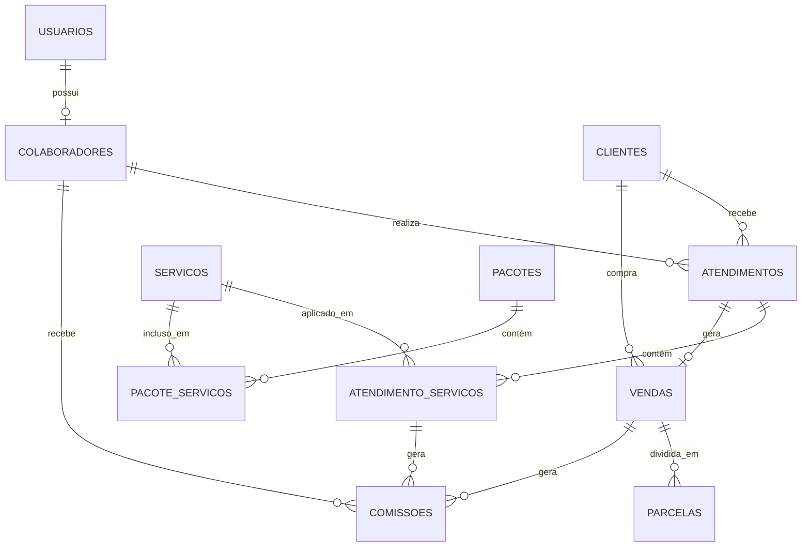

# PRD-PROMPT: Arquitetura de Dados - Sistema JS Beauty Studio

## CONTEXTO E OBJETIVO

Você é um arquiteto de banco de dados responsável por criar toda a estrutura de dados para o sistema de gestão JS Beauty Studio. Sua missão é criar um schema de banco de dados PostgreSQL completo, normalizado (3FN), com todas as tabelas, relacionamentos, índices, triggers e constraints necessários para o funcionamento do sistema.

## TECNOLOGIA OBRIGATÓRIA

- **Banco de Dados**: PostgreSQL 15+
- **ORM**: Prisma (o schema Prisma será gerado após criação do SQL)
- **Migrations**: Prisma Migrate
- **Normalização**: 3ª Forma Normal (3FN)
- **Encoding**: UTF-8

## REQUISITOS DO BANCO DE DADOS

### Princípios de Design
1. **Normalização**: Todas as tabelas devem estar na 3FN
2. **Integridade Referencial**: Usar FOREIGN KEYS para todos os relacionamentos
3. **Constraints**: Validar dados no nível do banco
4. **Índices**: Criar índices para queries frequentes
5. **Audit Trail**: Timestamps (created_at, updated_at) em todas as tabelas
6. **Soft Delete**: Usar flags (ativo/status) ao invés de DELETE físico
7. **Performance**: Otimizar para leitura (sistema OLTP)

### Convenções de Nomenclatura
- **Tabelas**: Plural, snake_case (ex: `clientes`, `atendimentos`)
- **Colunas**: snake_case (ex: `data_nascimento`, `valor_total`)
- **PKs**: Sempre `id` do tipo SERIAL/INTEGER
- **FKs**: Nome da tabela + `_id` (ex: `cliente_id`, `servico_id`)
- **Índices**: `idx_{tabela}_{coluna(s)}` (ex: `idx_clientes_nome`)
- **Constraints**: `{tipo}_{tabela}_{coluna}` (ex: `chk_vendas_valor`)

## MODELO ENTIDADE-RELACIONAMENTO (ER)

### Entidades Principais

```
1. USUARIOS (Sistema de Login)
   - Gerenciam acesso ao sistema
   - Relacionamento 1:1 opcional com COLABORADORES

2. CLIENTES (Gestão Comercial)
   - Pessoas que recebem serviços
   - Podem ser: ativos, inativos ou prospectos
   - Histórico completo de atendimentos e compras

3. COLABORADORES (Recursos Humanos)
   - Profissionais que prestam serviços
   - Recebem comissões
   - Podem ter acesso ao sistema (usuário)

4. SERVICOS (Catálogo)
   - Serviços oferecidos pelo salão
   - Preço, duração e comissão
   - Base para atendimentos

5. PACOTES (Ofertas)
   - Conjuntos de serviços com desconto
   - Validade em dias
   - N:N com serviços

6. PRODUTOS (Estoque)
   - Produtos vendidos
   - Controle de estoque

7. ATENDIMENTOS (Operação)
   - Agendamento de serviços
   - Vínculo cliente-colaborador-serviços
   - Status workflow: agendado → em_atendimento → concluído

8. VENDAS (Financeiro)
   - Registro de todas as vendas
   - Vinculada a atendimento (opcional)
   - Pode ser parcelada

9. DESPESAS (Financeiro)
   - Custos e despesas do negócio
   - Podem ser recorrentes
   - Status de pagamento

10. COMISSOES (Financeiro)
    - Comissões a pagar para colaboradores
    - Calculadas a partir de vendas/serviços
```

## SCRIPT SQL COMPLETO

### IMPORTANTE: Execute este script na ordem apresentada!

```sql
-- ==============================================================================
-- SISTEMA DE GESTÃO JS BEAUTY STUDIO
-- Database: PostgreSQL 15+
-- Author: Sistema de Gestão
-- Date: 2025-01-20
-- ==============================================================================

-- ==============================================================================
-- PARTE 1: CRIAÇÃO DE ENUMS (TIPOS PERSONALIZADOS)
-- ==============================================================================

-- Enum para perfil de usuário
CREATE TYPE perfil_usuario AS ENUM ('admin', 'gerente', 'atendente', 'profissional');

-- Enum para status de cliente
CREATE TYPE status_cliente AS ENUM ('ativo', 'inativo', 'prospecto');

-- Enum para tipo de colaborador
CREATE TYPE tipo_colaborador AS ENUM ('profissional', 'administrativo');

-- Enum para tipo de comissão
CREATE TYPE tipo_comissao AS ENUM ('percentual', 'fixo');

-- Enum para status de atendimento
CREATE TYPE status_atendimento AS ENUM ('agendado', 'em_atendimento', 'concluido', 'cancelado');

-- Enum para tipo de venda
CREATE TYPE tipo_venda AS ENUM ('servico', 'pacote', 'produto');

-- Enum para forma de pagamento
CREATE TYPE forma_pagamento AS ENUM ('dinheiro', 'debito', 'credito', 'pix', 'transferencia');

-- Enum para status de pagamento
CREATE TYPE status_pagamento AS ENUM ('pendente', 'parcial', 'pago', 'cancelado');

-- Enum para status de parcela
CREATE TYPE status_parcela AS ENUM ('pendente', 'pago', 'vencido');

-- Enum para status de despesa
CREATE TYPE status_despesa AS ENUM ('pendente', 'pago', 'vencido', 'cancelado');

-- Enum para status de comissão
CREATE TYPE status_comissao AS ENUM ('pendente', 'pago');

-- Enum para tipo de transação (maquininha)
CREATE TYPE tipo_transacao AS ENUM ('debito', 'credito');

-- Enum para periodicidade de despesa
CREATE TYPE periodicidade_despesa AS ENUM ('mensal', 'bimestral', 'trimestral', 'semestral', 'anual');

-- ==============================================================================
-- PARTE 2: CRIAÇÃO DAS TABELAS
-- ==============================================================================

-- ------------------------------------------------------------------------------
-- TABELA: usuarios
-- Descrição: Usuários do sistema com credenciais de acesso
-- ------------------------------------------------------------------------------
CREATE TABLE usuarios (
    id SERIAL PRIMARY KEY,
    nome VARCHAR(100) NOT NULL,
    email VARCHAR(100) UNIQUE NOT NULL,
    senha_hash VARCHAR(255) NOT NULL,
    perfil perfil_usuario NOT NULL,
    ativo BOOLEAN DEFAULT TRUE NOT NULL,
    created_at TIMESTAMP DEFAULT CURRENT_TIMESTAMP NOT NULL,
    updated_at TIMESTAMP DEFAULT CURRENT_TIMESTAMP NOT NULL,
    
    CONSTRAINT chk_usuarios_email CHECK (email ~* '^[A-Za-z0-9._%+-]+@[A-Za-z0-9.-]+\.[A-Za-z]{2,}$'),
    CONSTRAINT chk_usuarios_nome CHECK (LENGTH(nome) >= 3)
);

COMMENT ON TABLE usuarios IS 'Usuários do sistema com credenciais de acesso';
COMMENT ON COLUMN usuarios.senha_hash IS 'Hash bcrypt da senha (nunca armazenar senha em texto plano)';
COMMENT ON COLUMN usuarios.perfil IS 'Perfil de acesso: admin, gerente, atendente, profissional';

-- ------------------------------------------------------------------------------
-- TABELA: clientes
-- Descrição: Clientes do salão (ativos, inativos ou prospectos)
-- ------------------------------------------------------------------------------
CREATE TABLE clientes (
    id SERIAL PRIMARY KEY,
    nome VARCHAR(100) NOT NULL,
    telefone VARCHAR(20) NOT NULL,
    email VARCHAR(100),
    data_nascimento DATE,
    cpf VARCHAR(14) UNIQUE,
    endereco TEXT,
    cidade VARCHAR(100),
    estado VARCHAR(2),
    cep VARCHAR(9),
    observacoes TEXT,
    status status_cliente DEFAULT 'ativo' NOT NULL,
    created_at TIMESTAMP DEFAULT CURRENT_TIMESTAMP NOT NULL,
    updated_at TIMESTAMP DEFAULT CURRENT_TIMESTAMP NOT NULL,
    ultima_visita TIMESTAMP,
    
    CONSTRAINT chk_clientes_nome CHECK (LENGTH(nome) >= 3),
    CONSTRAINT chk_clientes_telefone CHECK (telefone ~ '^\d{10,11}$'),
    CONSTRAINT chk_clientes_cpf CHECK (cpf IS NULL OR cpf ~ '^\d{11}$'),
    CONSTRAINT chk_clientes_email CHECK (email IS NULL OR email ~* '^[A-Za-z0-9._%+-]+@[A-Za-z0-9.-]+\.[A-Za-z]{2,}$'),
    CONSTRAINT chk_clientes_estado CHECK (estado IS NULL OR LENGTH(estado) = 2),
    CONSTRAINT chk_clientes_cep CHECK (cep IS NULL OR cep ~ '^\d{8}$')
);

COMMENT ON TABLE clientes IS 'Cadastro de clientes do salão';
COMMENT ON COLUMN clientes.status IS 'ativo: cliente regular | inativo: cliente inativo | prospecto: cliente em prospecção';
COMMENT ON COLUMN clientes.ultima_visita IS 'Data/hora do último atendimento concluído';

-- ------------------------------------------------------------------------------
-- TABELA: colaboradores
-- Descrição: Profissionais e funcionários administrativos
-- ------------------------------------------------------------------------------
CREATE TABLE colaboradores (
    id SERIAL PRIMARY KEY,
    nome VARCHAR(100) NOT NULL,
    tipo tipo_colaborador NOT NULL,
    telefone VARCHAR(20),
    email VARCHAR(100),
    cpf VARCHAR(14) UNIQUE,
    data_admissao DATE,
    comissao_padrao DECIMAL(5,2),
    usuario_id INTEGER UNIQUE,
    ativo BOOLEAN DEFAULT TRUE NOT NULL,
    created_at TIMESTAMP DEFAULT CURRENT_TIMESTAMP NOT NULL,
    
    CONSTRAINT fk_colaboradores_usuario FOREIGN KEY (usuario_id) 
        REFERENCES usuarios(id) ON DELETE SET NULL,
    CONSTRAINT chk_colaboradores_nome CHECK (LENGTH(nome) >= 3),
    CONSTRAINT chk_colaboradores_telefone CHECK (telefone IS NULL OR telefone ~ '^\d{10,11}$'),
    CONSTRAINT chk_colaboradores_cpf CHECK (cpf IS NULL OR cpf ~ '^\d{11}$'),
    CONSTRAINT chk_colaboradores_comissao CHECK (comissao_padrao IS NULL OR (comissao_padrao >= 0 AND comissao_padrao <= 100))
);

COMMENT ON TABLE colaboradores IS 'Profissionais que prestam serviços e equipe administrativa';
COMMENT ON COLUMN colaboradores.tipo IS 'profissional: presta serviços | administrativo: equipe de suporte';
COMMENT ON COLUMN colaboradores.comissao_padrao IS 'Percentual de comissão padrão (0-100)';
COMMENT ON COLUMN colaboradores.usuario_id IS 'Relacionamento 1:1 opcional com tabela usuarios';

-- ------------------------------------------------------------------------------
-- TABELA: servicos
-- Descrição: Catálogo de serviços oferecidos
-- ------------------------------------------------------------------------------
CREATE TABLE servicos (
    id SERIAL PRIMARY KEY,
    nome VARCHAR(100) NOT NULL,
    descricao TEXT,
    categoria VARCHAR(50),
    duracao_minutos INTEGER NOT NULL,
    valor DECIMAL(10,2) NOT NULL,
    comissao_tipo tipo_comissao NOT NULL,
    comissao_valor DECIMAL(10,2) NOT NULL,
    ativo BOOLEAN DEFAULT TRUE NOT NULL,
    created_at TIMESTAMP DEFAULT CURRENT_TIMESTAMP NOT NULL,
    
    CONSTRAINT chk_servicos_nome CHECK (LENGTH(nome) >= 3),
    CONSTRAINT chk_servicos_duracao CHECK (duracao_minutos > 0),
    CONSTRAINT chk_servicos_valor CHECK (valor >= 0),
    CONSTRAINT chk_servicos_comissao CHECK (comissao_valor >= 0)
);

COMMENT ON TABLE servicos IS 'Catálogo de serviços oferecidos pelo salão';
COMMENT ON COLUMN servicos.comissao_tipo IS 'percentual: comissão em % | fixo: comissão em R$ fixo';
COMMENT ON COLUMN servicos.comissao_valor IS 'Se tipo=percentual: 0-100 | Se tipo=fixo: valor em R$';

-- ------------------------------------------------------------------------------
-- TABELA: pacotes
-- Descrição: Pacotes de serviços com desconto
-- ------------------------------------------------------------------------------
CREATE TABLE pacotes (
    id SERIAL PRIMARY KEY,
    nome VARCHAR(100) NOT NULL,
    descricao TEXT,
    valor DECIMAL(10,2) NOT NULL,
    validade_dias INTEGER,
    ativo BOOLEAN DEFAULT TRUE NOT NULL,
    created_at TIMESTAMP DEFAULT CURRENT_TIMESTAMP NOT NULL,
    
    CONSTRAINT chk_pacotes_nome CHECK (LENGTH(nome) >= 3),
    CONSTRAINT chk_pacotes_valor CHECK (valor >= 0),
    CONSTRAINT chk_pacotes_validade CHECK (validade_dias IS NULL OR validade_dias > 0)
);

COMMENT ON TABLE pacotes IS 'Pacotes promocionais de serviços';
COMMENT ON COLUMN pacotes.validade_dias IS 'Validade do pacote após a compra (em dias)';

-- ------------------------------------------------------------------------------
-- TABELA: pacote_servicos
-- Descrição: Relacionamento N:N entre pacotes e serviços
-- ------------------------------------------------------------------------------
CREATE TABLE pacote_servicos (
    id SERIAL PRIMARY KEY,
    pacote_id INTEGER NOT NULL,
    servico_id INTEGER NOT NULL,
    quantidade INTEGER DEFAULT 1 NOT NULL,
    
    CONSTRAINT fk_pacote_servicos_pacote FOREIGN KEY (pacote_id) 
        REFERENCES pacotes(id) ON DELETE CASCADE,
    CONSTRAINT fk_pacote_servicos_servico FOREIGN KEY (servico_id) 
        REFERENCES servicos(id) ON DELETE CASCADE,
    CONSTRAINT chk_pacote_servicos_quantidade CHECK (quantidade > 0),
    CONSTRAINT uq_pacote_servicos UNIQUE (pacote_id, servico_id)
);

COMMENT ON TABLE pacote_servicos IS 'Serviços inclusos em cada pacote';
COMMENT ON COLUMN pacote_servicos.quantidade IS 'Quantidade de vezes que o serviço pode ser usado no pacote';

-- ------------------------------------------------------------------------------
-- TABELA: produtos
-- Descrição: Produtos disponíveis para venda
-- ------------------------------------------------------------------------------
CREATE TABLE produtos (
    id SERIAL PRIMARY KEY,
    nome VARCHAR(100) NOT NULL,
    descricao TEXT,
    codigo_barras VARCHAR(50),
    categoria VARCHAR(50),
    valor_custo DECIMAL(10,2),
    valor_venda DECIMAL(10,2) NOT NULL,
    estoque_atual INTEGER DEFAULT 0 NOT NULL,
    estoque_minimo INTEGER DEFAULT 0 NOT NULL,
    ativo BOOLEAN DEFAULT TRUE NOT NULL,
    created_at TIMESTAMP DEFAULT CURRENT_TIMESTAMP NOT NULL,
    updated_at TIMESTAMP DEFAULT CURRENT_TIMESTAMP NOT NULL,
    
    CONSTRAINT chk_produtos_nome CHECK (LENGTH(nome) >= 3),
    CONSTRAINT chk_produtos_valor_custo CHECK (valor_custo IS NULL OR valor_custo >= 0),
    CONSTRAINT chk_produtos_valor_venda CHECK (valor_venda >= 0),
    CONSTRAINT chk_produtos_estoque_atual CHECK (estoque_atual >= 0),
    CONSTRAINT chk_produtos_estoque_minimo CHECK (estoque_minimo >= 0)
);

COMMENT ON TABLE produtos IS 'Catálogo de produtos para venda';
COMMENT ON COLUMN produtos.estoque_minimo IS 'Quantidade mínima antes de alerta de reposição';

-- ------------------------------------------------------------------------------
-- TABELA: atendimentos
-- Descrição: Agendamentos e atendimentos realizados
-- ------------------------------------------------------------------------------
CREATE TABLE atendimentos (
    id SERIAL PRIMARY KEY,
    cliente_id INTEGER NOT NULL,
    colaborador_id INTEGER NOT NULL,
    data_atendimento DATE NOT NULL,
    horario_inicio TIME NOT NULL,
    horario_fim TIME,
    status status_atendimento NOT NULL,
    observacoes TEXT,
    created_at TIMESTAMP DEFAULT CURRENT_TIMESTAMP NOT NULL,
    updated_at TIMESTAMP DEFAULT CURRENT_TIMESTAMP NOT NULL,
    
    CONSTRAINT fk_atendimentos_cliente FOREIGN KEY (cliente_id) 
        REFERENCES clientes(id) ON DELETE RESTRICT,
    CONSTRAINT fk_atendimentos_colaborador FOREIGN KEY (colaborador_id) 
        REFERENCES colaboradores(id) ON DELETE RESTRICT,
    CONSTRAINT chk_atendimentos_horario CHECK (horario_fim IS NULL OR horario_fim > horario_inicio)
);

COMMENT ON TABLE atendimentos IS 'Registro de agendamentos e atendimentos';
COMMENT ON COLUMN atendimentos.status IS 'Workflow: agendado → em_atendimento → concluido (ou cancelado)';

-- ------------------------------------------------------------------------------
-- TABELA: atendimento_servicos
-- Descrição: Serviços realizados em cada atendimento (N:N)
-- ------------------------------------------------------------------------------
CREATE TABLE atendimento_servicos (
    id SERIAL PRIMARY KEY,
    atendimento_id INTEGER NOT NULL,
    servico_id INTEGER NOT NULL,
    quantidade INTEGER DEFAULT 1 NOT NULL,
    valor_unitario DECIMAL(10,2) NOT NULL,
    desconto DECIMAL(10,2) DEFAULT 0 NOT NULL,
    
    CONSTRAINT fk_atendimento_servicos_atendimento FOREIGN KEY (atendimento_id) 
        REFERENCES atendimentos(id) ON DELETE CASCADE,
    CONSTRAINT fk_atendimento_servicos_servico FOREIGN KEY (servico_id) 
        REFERENCES servicos(id) ON DELETE RESTRICT,
    CONSTRAINT chk_atendimento_servicos_quantidade CHECK (quantidade > 0),
    CONSTRAINT chk_atendimento_servicos_valor CHECK (valor_unitario >= 0),
    CONSTRAINT chk_atendimento_servicos_desconto CHECK (desconto >= 0)
);

COMMENT ON TABLE atendimento_servicos IS 'Serviços aplicados em cada atendimento';
COMMENT ON COLUMN atendimento_servicos.valor_unitario IS 'Valor do serviço no momento do atendimento (pode diferir do cadastro)';
COMMENT ON COLUMN atendimento_servicos.desconto IS 'Desconto aplicado neste serviço específico';

-- ------------------------------------------------------------------------------
-- TABELA: vendas
-- Descrição: Registro de todas as vendas realizadas
-- ------------------------------------------------------------------------------
CREATE TABLE vendas (
    id SERIAL PRIMARY KEY,
    cliente_id INTEGER NOT NULL,
    atendimento_id INTEGER,
    tipo_venda tipo_venda NOT NULL,
    data_venda DATE NOT NULL,
    valor_total DECIMAL(10,2) NOT NULL,
    desconto DECIMAL(10,2) DEFAULT 0 NOT NULL,
    valor_final DECIMAL(10,2) NOT NULL,
    forma_pagamento forma_pagamento NOT NULL,
    status_pagamento status_pagamento NOT NULL,
    parcelas INTEGER DEFAULT 1 NOT NULL,
    taxa_maquininha DECIMAL(5,2),
    observacoes TEXT,
    created_at TIMESTAMP DEFAULT CURRENT_TIMESTAMP NOT NULL,
    
    CONSTRAINT fk_vendas_cliente FOREIGN KEY (cliente_id) 
        REFERENCES clientes(id) ON DELETE RESTRICT,
    CONSTRAINT fk_vendas_atendimento FOREIGN KEY (atendimento_id) 
        REFERENCES atendimentos(id) ON DELETE SET NULL,
    CONSTRAINT chk_vendas_valor_total CHECK (valor_total >= 0),
    CONSTRAINT chk_vendas_desconto CHECK (desconto >= 0),
    CONSTRAINT chk_vendas_valor_final CHECK (valor_final >= 0),
    CONSTRAINT chk_vendas_parcelas CHECK (parcelas > 0),
    CONSTRAINT chk_vendas_taxa CHECK (taxa_maquininha IS NULL OR (taxa_maquininha >= 0 AND taxa_maquininha <= 100))
);

COMMENT ON TABLE vendas IS 'Registro financeiro de todas as vendas';
COMMENT ON COLUMN vendas.tipo_venda IS 'servico: venda de serviço | pacote: venda de pacote | produto: venda de produto';
COMMENT ON COLUMN vendas.valor_final IS 'valor_total - desconto + taxas';
COMMENT ON COLUMN vendas.taxa_maquininha IS 'Taxa da maquininha de cartão (percentual)';

-- ------------------------------------------------------------------------------
-- TABELA: parcelas
-- Descrição: Parcelas de vendas parceladas
-- ------------------------------------------------------------------------------
CREATE TABLE parcelas (
    id SERIAL PRIMARY KEY,
    venda_id INTEGER NOT NULL,
    numero_parcela INTEGER NOT NULL,
    valor_parcela DECIMAL(10,2) NOT NULL,
    data_vencimento DATE NOT NULL,
    data_pagamento DATE,
    status status_parcela DEFAULT 'pendente' NOT NULL,
    created_at TIMESTAMP DEFAULT CURRENT_TIMESTAMP NOT NULL,
    
    CONSTRAINT fk_parcelas_venda FOREIGN KEY (venda_id) 
        REFERENCES vendas(id) ON DELETE CASCADE,
    CONSTRAINT chk_parcelas_numero CHECK (numero_parcela > 0),
    CONSTRAINT chk_parcelas_valor CHECK (valor_parcela > 0),
    CONSTRAINT uq_parcelas UNIQUE (venda_id, numero_parcela)
);

COMMENT ON TABLE parcelas IS 'Controle de parcelas de vendas parceladas';

-- ------------------------------------------------------------------------------
-- TABELA: despesas
-- Descrição: Despesas e custos do negócio
-- ------------------------------------------------------------------------------
CREATE TABLE despesas (
    id SERIAL PRIMARY KEY,
    descricao VARCHAR(200) NOT NULL,
    categoria VARCHAR(50) NOT NULL,
    valor DECIMAL(10,2) NOT NULL,
    data_vencimento DATE NOT NULL,
    data_pagamento DATE,
    status status_despesa NOT NULL,
    recorrente BOOLEAN DEFAULT FALSE NOT NULL,
    periodicidade periodicidade_despesa,
    forma_pagamento VARCHAR(50),
    observacoes TEXT,
    created_at TIMESTAMP DEFAULT CURRENT_TIMESTAMP NOT NULL,
    
    CONSTRAINT chk_despesas_descricao CHECK (LENGTH(descricao) >= 3),
    CONSTRAINT chk_despesas_valor CHECK (valor >= 0),
    CONSTRAINT chk_despesas_periodicidade CHECK (
        (recorrente = FALSE AND periodicidade IS NULL) OR
        (recorrente = TRUE AND periodicidade IS NOT NULL)
    )
);

COMMENT ON TABLE despesas IS 'Registro de despesas e custos operacionais';
COMMENT ON COLUMN despesas.recorrente IS 'Se TRUE, despesa se repete automaticamente';
COMMENT ON COLUMN despesas.periodicidade IS 'Periodicidade se recorrente: mensal, trimestral, etc';

-- ------------------------------------------------------------------------------
-- TABELA: comissoes
-- Descrição: Comissões a pagar para colaboradores
-- ------------------------------------------------------------------------------
CREATE TABLE comissoes (
    id SERIAL PRIMARY KEY,
    colaborador_id INTEGER NOT NULL,
    venda_id INTEGER,
    atendimento_servico_id INTEGER,
    valor_base DECIMAL(10,2) NOT NULL,
    percentual DECIMAL(5,2),
    valor_comissao DECIMAL(10,2) NOT NULL,
    data_referencia DATE NOT NULL,
    status status_comissao DEFAULT 'pendente' NOT NULL,
    data_pagamento DATE,
    created_at TIMESTAMP DEFAULT CURRENT_TIMESTAMP NOT NULL,
    
    CONSTRAINT fk_comissoes_colaborador FOREIGN KEY (colaborador_id) 
        REFERENCES colaboradores(id) ON DELETE RESTRICT,
    CONSTRAINT fk_comissoes_venda FOREIGN KEY (venda_id) 
        REFERENCES vendas(id) ON DELETE SET NULL,
    CONSTRAINT fk_comissoes_atendimento_servico FOREIGN KEY (atendimento_servico_id) 
        REFERENCES atendimento_servicos(id) ON DELETE SET NULL,
    CONSTRAINT chk_comissoes_valor_base CHECK (valor_base >= 0),
    CONSTRAINT chk_comissoes_percentual CHECK (percentual IS NULL OR (percentual >= 0 AND percentual <= 100)),
    CONSTRAINT chk_comissoes_valor CHECK (valor_comissao >= 0),
    CONSTRAINT chk_comissoes_origem CHECK (venda_id IS NOT NULL OR atendimento_servico_id IS NOT NULL)
);

COMMENT ON TABLE comissoes IS 'Comissões calculadas para colaboradores';
COMMENT ON COLUMN comissoes.valor_base IS 'Valor sobre o qual a comissão foi calculada';
COMMENT ON COLUMN comissoes.percentual IS 'Percentual aplicado (se comissão percentual)';

-- ------------------------------------------------------------------------------
-- TABELA: taxas_maquininha
-- Descrição: Taxas cobradas por bandeira e tipo de transação
-- ------------------------------------------------------------------------------
CREATE TABLE taxas_maquininha (
    id SERIAL PRIMARY KEY,
    bandeira VARCHAR(50) NOT NULL,
    tipo_transacao tipo_transacao NOT NULL,
    parcelas INTEGER DEFAULT 1 NOT NULL,
    taxa_percentual DECIMAL(5,2) NOT NULL,
    ativo BOOLEAN DEFAULT TRUE NOT NULL,
    
    CONSTRAINT chk_taxas_bandeira CHECK (LENGTH(bandeira) >= 3),
    CONSTRAINT chk_taxas_parcelas CHECK (parcelas > 0),
    CONSTRAINT chk_taxas_percentual CHECK (taxa_percentual >= 0 AND taxa_percentual <= 100),
    CONSTRAINT uq_taxas_maquininha UNIQUE (bandeira, tipo_transacao, parcelas)
);

COMMENT ON TABLE taxas_maquininha IS 'Configuração de taxas de cartão por bandeira e modalidade';

-- ==============================================================================
-- PARTE 3: CRIAÇÃO DE ÍNDICES PARA PERFORMANCE
-- ==============================================================================

-- Índices para tabela usuarios
CREATE INDEX idx_usuarios_email ON usuarios(email);
CREATE INDEX idx_usuarios_ativo ON usuarios(ativo);

-- Índices para tabela clientes
CREATE INDEX idx_clientes_nome ON clientes(nome);
CREATE INDEX idx_clientes_telefone ON clientes(telefone);
CREATE INDEX idx_clientes_cpf ON clientes(cpf) WHERE cpf IS NOT NULL;
CREATE INDEX idx_clientes_email ON clientes(email) WHERE email IS NOT NULL;
CREATE INDEX idx_clientes_status ON clientes(status);
CREATE INDEX idx_clientes_created_at ON clientes(created_at DESC);

-- Índices para tabela colaboradores
CREATE INDEX idx_colaboradores_nome ON colaboradores(nome);
CREATE INDEX idx_colaboradores_tipo ON colaboradores(tipo);
CREATE INDEX idx_colaboradores_ativo ON colaboradores(ativo);
CREATE INDEX idx_colaboradores_usuario_id ON colaboradores(usuario_id) WHERE usuario_id IS NOT NULL;

-- Índices para tabela servicos
CREATE INDEX idx_servicos_nome ON servicos(nome);
CREATE INDEX idx_servicos_categoria ON servicos(categoria) WHERE categoria IS NOT NULL;
CREATE INDEX idx_servicos_ativo ON servicos(ativo);

-- Índices para tabela atendimentos
CREATE INDEX idx_atendimentos_cliente_id ON atendimentos(cliente_id);
CREATE INDEX idx_atendimentos_colaborador_id ON atendimentos(colaborador_id);
CREATE INDEX idx_atendimentos_data ON atendimentos(data_atendimento DESC);
CREATE INDEX idx_atendimentos_status ON atendimentos(status);
CREATE INDEX idx_atendimentos_data_colaborador ON atendimentos(data_atendimento, colaborador_id);

-- Índices para tabela atendimento_servicos
CREATE INDEX idx_atendimento_servicos_atendimento ON atendimento_servicos(atendimento_id);
CREATE INDEX idx_atendimento_servicos_servico ON atendimento_servicos(servico_id);

-- Índices para tabela vendas
CREATE INDEX idx_vendas_cliente_id ON vendas(cliente_id);
CREATE INDEX idx_vendas_data ON vendas(data_venda DESC);
CREATE INDEX idx_vendas_tipo ON vendas(tipo_venda);
CREATE INDEX idx_vendas_status ON vendas(status_pagamento);
CREATE INDEX idx_vendas_atendimento ON vendas(atendimento_id) WHERE atendimento_id IS NOT NULL;

-- Índices para tabela parcelas
CREATE INDEX idx_parcelas_venda_id ON parcelas(venda_id);
CREATE INDEX idx_parcelas_status ON parcelas(status);
CREATE INDEX idx_parcelas_vencimento ON parcelas(data_vencimento);

-- Índices para tabela despesas
CREATE INDEX idx_despesas_data_vencimento ON despesas(data_vencimento);
CREATE INDEX idx_despesas_status ON despesas(status);
CREATE INDEX idx_despesas_categoria ON despesas(categoria);
CREATE INDEX idx_despesas_recorrente ON despesas(recorrente);

-- Índices para tabela comissoes
CREATE INDEX idx_comissoes_colaborador_id ON comissoes(colaborador_id);
CREATE INDEX idx_comissoes_status ON comissoes(status);
CREATE INDEX idx_comissoes_data_referencia ON comissoes(data_referencia);
CREATE INDEX idx_comissoes_venda_id ON comissoes(venda_id) WHERE venda_id IS NOT NULL;

-- ==============================================================================
-- PARTE 4: TRIGGERS E FUNCTIONS
-- ==============================================================================

-- ------------------------------------------------------------------------------
-- TRIGGER: Atualizar updated_at automaticamente
-- ------------------------------------------------------------------------------
CREATE OR REPLACE FUNCTION trigger_set_timestamp()
RETURNS TRIGGER AS $$
BEGIN
    NEW.updated_at = CURRENT_TIMESTAMP;
    RETURN NEW;
END;
$$ LANGUAGE plpgsql;

-- Aplicar trigger em tabelas com updated_at
CREATE TRIGGER set_timestamp_usuarios
    BEFORE UPDATE ON usuarios
    FOR EACH ROW
    EXECUTE FUNCTION trigger_set_timestamp();

CREATE TRIGGER set_timestamp_clientes
    BEFORE UPDATE ON clientes
    FOR EACH ROW
    EXECUTE FUNCTION trigger_set_timestamp();

CREATE TRIGGER set_timestamp_produtos
    BEFORE UPDATE ON produtos
    FOR EACH ROW
    EXECUTE FUNCTION trigger_set_timestamp();

CREATE TRIGGER set_timestamp_atendimentos
    BEFORE UPDATE ON atendimentos
    FOR EACH ROW
    EXECUTE FUNCTION trigger_set_timestamp();

-- ------------------------------------------------------------------------------
-- TRIGGER: Atualizar ultima_visita do cliente
-- ------------------------------------------------------------------------------
CREATE OR REPLACE FUNCTION trigger_atualizar_ultima_visita()
RETURNS TRIGGER AS $$
BEGIN
    -- Quando atendimento é concluído, atualizar ultima_visita do cliente
    IF NEW.status = 'concluido' AND (OLD.status IS NULL OR OLD.status != 'concluido') THEN
        UPDATE clientes 
        SET ultima_visita = NEW.updated_at 
        WHERE id = NEW.cliente_id;
    END IF;
    RETURN NEW;
END;
$$ LANGUAGE plpgsql;

CREATE TRIGGER atualizar_ultima_visita
    AFTER UPDATE ON atendimentos
    FOR EACH ROW
    EXECUTE FUNCTION trigger_atualizar_ultima_visita();

-- ------------------------------------------------------------------------------
-- TRIGGER: Atualizar status de parcelas vencidas
-- ------------------------------------------------------------------------------
CREATE OR REPLACE FUNCTION trigger_atualizar_parcelas_vencidas()
RETURNS TRIGGER AS $$
BEGIN
    -- Se data_vencimento passou e ainda está pendente, marcar como vencido
    IF NEW.data_vencimento < CURRENT_DATE AND NEW.status = 'pendente' THEN
        NEW.status = 'vencido';
    END IF;
    RETURN NEW;
END;
$$ LANGUAGE plpgsql;

CREATE TRIGGER atualizar_parcelas_vencidas
    BEFORE UPDATE ON parcelas
    FOR EACH ROW
    EXECUTE FUNCTION trigger_atualizar_parcelas_vencidas();

-- ------------------------------------------------------------------------------
-- TRIGGER: Validar horário de atendimento (não conflitar)
-- ------------------------------------------------------------------------------
CREATE OR REPLACE FUNCTION trigger_validar_conflito_horario()
RETURNS TRIGGER AS $$
DECLARE
    conflitos INTEGER;
BEGIN
    -- Verificar se já existe atendimento para o mesmo colaborador no mesmo horário
    SELECT COUNT(*) INTO conflitos
    FROM atendimentos
    WHERE colaborador_id = NEW.colaborador_id
      AND data_atendimento = NEW.data_atendimento
      AND status IN ('agendado', 'em_atendimento')
      AND id != COALESCE(NEW.id, 0)
      AND (
          (NEW.horario_inicio >= horario_inicio AND NEW.horario_inicio < COALESCE(horario_fim, '23:59:59')) OR
          (COALESCE(NEW.horario_fim, '23:59:59') > horario_inicio AND COALESCE(NEW.horario_fim, '23:59:59') <= COALESCE(horario_fim, '23:59:59')) OR
          (NEW.horario_inicio <= horario_inicio AND COALESCE(NEW.horario_fim, '23:59:59') >= COALESCE(horario_fim, '23:59:59'))
      );
    
    IF conflitos > 0 THEN
        RAISE EXCEPTION 'Conflito de horário: colaborador já possui atendimento agendado neste horário';
    END IF;
    
    RETURN NEW;
END;
$$ LANGUAGE plpgsql;

CREATE TRIGGER validar_conflito_horario
    BEFORE INSERT OR UPDATE ON atendimentos
    FOR EACH ROW
    EXECUTE FUNCTION trigger_validar_conflito_horario();

-- ==============================================================================
-- PARTE 5: VIEWS ÚTEIS
-- ==============================================================================

-- ------------------------------------------------------------------------------
-- VIEW: Resumo financeiro mensal
-- ------------------------------------------------------------------------------
CREATE OR REPLACE VIEW view_resumo_financeiro_mensal AS
SELECT 
    DATE_TRUNC('month', data_venda) as mes,
    COUNT(*) as total_vendas,
    SUM(valor_final) as receita_total,
    AVG(valor_final) as ticket_medio
FROM vendas
WHERE status_pagamento != 'cancelado'
GROUP BY DATE_TRUNC('month', data_venda)
ORDER BY mes DESC;

COMMENT ON VIEW view_resumo_financeiro_mensal IS 'Resumo de vendas agrupado por mês';

-- ------------------------------------------------------------------------------
-- VIEW: Atendimentos do dia por profissional
-- ------------------------------------------------------------------------------
CREATE OR REPLACE VIEW view_agenda_dia AS
SELECT 
    a.id,
    a.data_atendimento,
    a.horario_inicio,
    a.horario_fim,
    a.status,
    c.id as cliente_id,
    c.nome as cliente_nome,
    c.telefone as cliente_telefone,
    col.id as colaborador_id,
    col.nome as colaborador_nome,
    STRING_AGG(s.nome, ', ') as servicos
FROM atendimentos a
INNER JOIN clientes c ON c.id = a.cliente_id
INNER JOIN colaboradores col ON col.id = a.colaborador_id
LEFT JOIN atendimento_servicos ats ON ats.atendimento_id = a.id
LEFT JOIN servicos s ON s.id = ats.servico_id
GROUP BY a.id, a.data_atendimento, a.horario_inicio, a.horario_fim, a.status,
         c.id, c.nome, c.telefone, col.id, col.nome;

COMMENT ON VIEW view_agenda_dia IS 'Visão consolidada da agenda de atendimentos';

-- ------------------------------------------------------------------------------
-- VIEW: Top clientes por faturamento
-- ------------------------------------------------------------------------------
CREATE OR REPLACE VIEW view_top_clientes AS
SELECT 
    c.id,
    c.nome,
    c.telefone,
    c.email,
    COUNT(DISTINCT v.id) as total_compras,
    SUM(v.valor_final) as valor_total_gasto,
    MAX(v.data_venda) as ultima_compra
FROM clientes c
INNER JOIN vendas v ON v.cliente_id = c.id
WHERE v.status_pagamento != 'cancelado'
GROUP BY c.id, c.nome, c.telefone, c.email
ORDER BY valor_total_gasto DESC;

COMMENT ON VIEW view_top_clientes IS 'Clientes ordenados por valor total gasto';

-- ==============================================================================
-- PARTE 6: DADOS INICIAIS (SEEDS)
-- ==============================================================================

-- Usuário admin padrão (senha: admin123 - MUDAR EM PRODUÇÃO!)
-- Hash bcrypt de "admin123": $2a$10$xGqPT7LqJmvp4qC.vNQ8a.TJ5uqMwqLG8rHqLRQEQBvqWKLR9k2OO
INSERT INTO usuarios (nome, email, senha_hash, perfil) VALUES
('Administrador', 'admin@jsbeauty.com', '$2a$10$xGqPT7LqJmvp4qC.vNQ8a.TJ5uqMwqLG8rHqLRQEQBvqWKLR9k2OO', 'admin');

-- Categorias padrão de serviços
INSERT INTO servicos (nome, categoria, duracao_minutos, valor, comissao_tipo, comissao_valor) VALUES
('Corte Feminino', 'Cabelo', 60, 80.00, 'percentual', 30.00),
('Corte Masculino', 'Cabelo', 30, 40.00, 'percentual', 30.00),
('Coloração Completa', 'Cabelo', 120, 150.00, 'percentual', 25.00),
('Escova', 'Cabelo', 45, 50.00, 'percentual', 30.00),
('Manicure', 'Unhas', 40, 35.00, 'percentual', 35.00),
('Pedicure', 'Unhas', 50, 45.00, 'percentual', 35.00),
('Design de Sobrancelhas', 'Design', 30, 30.00, 'percentual', 40.00),
('Depilação Facial', 'Depilação', 20, 25.00, 'percentual', 30.00),
('Massagem Relaxante', 'Estética', 60, 100.00, 'percentual', 30.00),
('Limpeza de Pele', 'Estética', 90, 120.00, 'percentual', 25.00);

-- Taxas de maquininha padrão
INSERT INTO taxas_maquininha (bandeira, tipo_transacao, parcelas, taxa_percentual) VALUES
('Visa', 'debito', 1, 1.99),
('Mastercard', 'debito', 1, 1.99),
('Elo', 'debito', 1, 1.99),
('Visa', 'credito', 1, 2.99),
('Visa', 'credito', 2, 4.49),
('Visa', 'credito', 3, 5.99),
('Visa', 'credito', 4, 6.99),
('Visa', 'credito', 5, 7.99),
('Visa', 'credito', 6, 8.99),
('Mastercard', 'credito', 1, 2.99),
('Mastercard', 'credito', 2, 4.49),
('Mastercard', 'credito', 3, 5.99);

-- ==============================================================================
-- PARTE 7: GRANTS E PERMISSÕES
-- ==============================================================================

-- Criar usuário da aplicação (ajustar conforme necessário)
-- CREATE USER jsbeauty_app WITH PASSWORD 'senha_segura_aqui';
-- GRANT CONNECT ON DATABASE jsbeauty TO jsbeauty_app;
-- GRANT USAGE ON SCHEMA public TO jsbeauty_app;
-- GRANT SELECT, INSERT, UPDATE, DELETE ON ALL TABLES IN SCHEMA public TO jsbeauty_app;
-- GRANT USAGE, SELECT ON ALL SEQUENCES IN SCHEMA public TO jsbeauty_app;

-- ==============================================================================
-- SCRIPT CONCLUÍDO
-- ==============================================================================

-- Verificar criação das tabelas
SELECT 
    schemaname,
    tablename,
    tableowner
FROM pg_tables
WHERE schemaname = 'public'
ORDER BY tablename;

-- Verificar enums criados
SELECT 
    n.nspname as schema,
    t.typname as enum_name,
    e.enumlabel as enum_value
FROM pg_type t 
JOIN pg_enum e ON t.oid = e.enumtypid  
JOIN pg_namespace n ON n.oid = t.typnamespace
WHERE n.nspname = 'public'
ORDER BY t.typname, e.enumsortorder;
```

## SCHEMA PRISMA (GERAR APÓS CRIAÇÃO DO SQL)

Após executar o script SQL acima, execute:

```bash
# Gerar Prisma Schema a partir do banco existente
npx prisma db pull

# Gerar Prisma Client
npx prisma generate
```

## VALIDAÇÕES E TESTES

### Script de Validação da Estrutura

```sql
-- ==============================================================================
-- SCRIPT DE VALIDAÇÃO DO BANCO DE DADOS
-- ==============================================================================

-- 1. Verificar todas as tabelas criadas
SELECT 'Tabelas Criadas:' as info;
SELECT tablename FROM pg_tables WHERE schemaname = 'public' ORDER BY tablename;

-- 2. Verificar Foreign Keys
SELECT 'Foreign Keys:' as info;
SELECT
    tc.table_name, 
    kcu.column_name, 
    ccu.table_name AS foreign_table_name,
    ccu.column_name AS foreign_column_name 
FROM information_schema.table_constraints AS tc 
JOIN information_schema.key_column_usage AS kcu
  ON tc.constraint_name = kcu.constraint_name
JOIN information_schema.constraint_column_usage AS ccu
  ON ccu.constraint_name = tc.constraint_name
WHERE tc.constraint_type = 'FOREIGN KEY' AND tc.table_schema='public'
ORDER BY tc.table_name;

-- 3. Verificar Índices
SELECT 'Índices Criados:' as info;
SELECT
    tablename,
    indexname,
    indexdef
FROM pg_indexes
WHERE schemaname = 'public'
ORDER BY tablename, indexname;

-- 4. Verificar Triggers
SELECT 'Triggers Criados:' as info;
SELECT
    trigger_name,
    event_manipulation,
    event_object_table,
    action_statement
FROM information_schema.triggers
WHERE trigger_schema = 'public'
ORDER BY event_object_table, trigger_name;

-- 5. Contar registros iniciais
SELECT 'Contagem de Registros Iniciais:' as info;
SELECT 'usuarios' as tabela, COUNT(*) as total FROM usuarios
UNION ALL
SELECT 'servicos', COUNT(*) FROM servicos
UNION ALL
SELECT 'taxas_maquininha', COUNT(*) FROM taxas_maquininha;
```

### Testes de Integridade

```sql
-- ==============================================================================
-- TESTES DE INTEGRIDADE
-- ==============================================================================

-- Teste 1: Inserir cliente
INSERT INTO clientes (nome, telefone, email, cpf) VALUES
('João da Silva', '11987654321', 'joao@email.com', '12345678901');

-- Teste 2: Inserir colaborador
INSERT INTO colaboradores (nome, tipo, telefone, comissao_padrao) VALUES
('Maria Santos', 'profissional', '11976543210', 30.00);

-- Teste 3: Criar atendimento
INSERT INTO atendimentos (cliente_id, colaborador_id, data_atendimento, horario_inicio, status) VALUES
(1, 1, CURRENT_DATE, '10:00', 'agendado');

-- Teste 4: Adicionar serviço ao atendimento
INSERT INTO atendimento_servicos (atendimento_id, servico_id, quantidade, valor_unitario) VALUES
(1, 1, 1, 80.00);

-- Teste 5: Criar venda
INSERT INTO vendas (cliente_id, atendimento_id, tipo_venda, data_venda, valor_total, valor_final, forma_pagamento, status_pagamento) VALUES
(1, 1, 'servico', CURRENT_DATE, 80.00, 80.00, 'dinheiro', 'pago');

-- Verificar se tudo foi inserido corretamente
SELECT 'Testes de Integridade Concluídos' as status;
SELECT * FROM view_agenda_dia WHERE data_atendimento = CURRENT_DATE;
```

## DIAGRAMA ER (MERMAID)



## CHECKLIST DE EXECUÇÃO

- [ ] Criar banco de dados PostgreSQL
- [ ] Executar script SQL completo (PARTE 1 a 7)
- [ ] Verificar criação de todas as tabelas (14 tabelas)
- [ ] Verificar criação de todos os ENUMs (14 enums)
- [ ] Verificar índices criados
- [ ] Verificar triggers ativos
- [ ] Executar script de validação
- [ ] Executar testes de integridade
- [ ] Gerar Prisma Schema (`npx prisma db pull`)
- [ ] Gerar Prisma Client (`npx prisma generate`)
- [ ] Verificar dados iniciais (usuário admin, serviços, taxas)
- [ ] Documentar credenciais de acesso
- [ ] Configurar backup automático

## NOTAS IMPORTANTES

1. **Senha do Admin**: A senha padrão `admin123` DEVE ser alterada em produção
2. **Backup**: Configure backup diário do banco de dados
3. **Performance**: Os índices foram otimizados para queries comuns
4. **Segurança**: Use SSL/TLS para conexões em produção
5. **Migrations**: Use Prisma Migrate para alterações futuras
6. **Monitoramento**: Configure logs e monitoramento de queries lentas

---

**Execute este PRD na ordem apresentada para garantir a criação correta de toda a estrutura de dados.**
